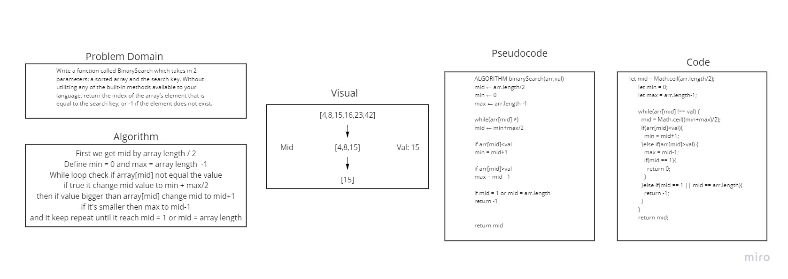

# Array Binary Search
Search for value using binary algorithm.

## Challenge
Write a function called BinarySearch which takes in 2 parameters: a sorted array and the search key. Without utilizing any of the built-in methods available to your language, return the index of the array’s element that is equal to the search key, or -1 if the element does not exist.

## Approach & Efficiency
First we need to find mid length of array, min zero and max is array length - 1.
Now using while loop we check if array[mid] value equal the value if not we will check if the value is bigger we change mid to mid + 1, and do while again and change mid value max+min/2 if the value smaller than array[mid] value we change max to mid - 1 until repete until it equal the value or no.

## Solution

