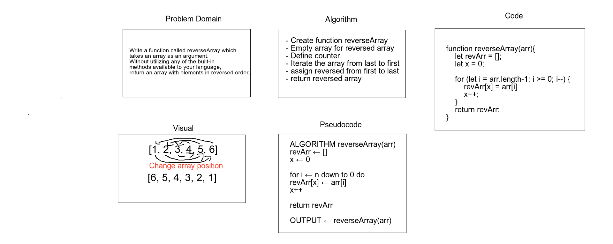

# Reverse an Array
everses an array in place. The first array element becomes the last, and the last array element becomes the first.

## Challenge
Write a function called reverseArray which takes an array as an argument. Without utilizing any of the built-in methods available to your language, return an array with elements in reversed order.

## Approach & Efficiency
Since I need to write function without utilizing any of the built-in methods available to your language, I directilry tought about using loop and start from the length of the array and it keep decressing and assign the new array from 0 to array length.

## Solution

