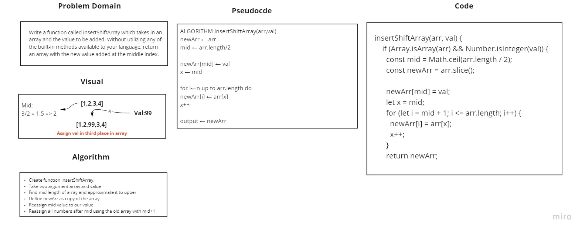

# Shift an Array
Function take value and put it into mid of the new array.

## Challenge
Write a function called insertShiftArray which takes in an array and the value to be added. Without utilizing any of the built-in methods available to your language, return an array with the new value added at the middle index.

## Approach & Efficiency
First we need to find the mid of the array and approximate it to upper number, now we copy the array to new one, in begninig replace the mid to our value, then filling the numbers into the new array after the mid.

## Solution

