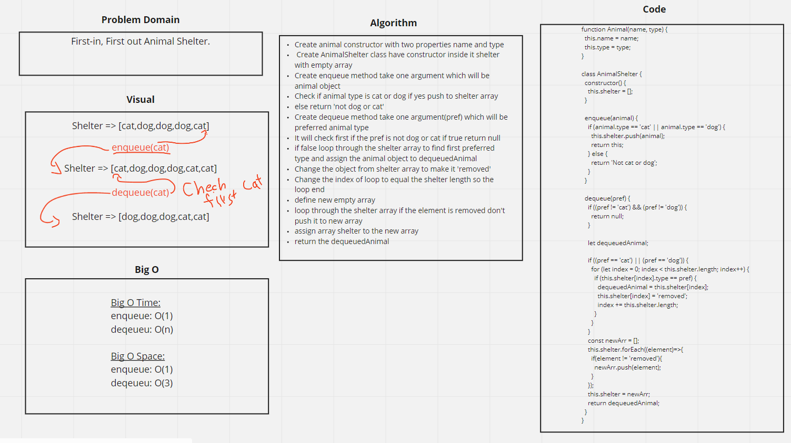

# Challenge Summary
First-in, First out Animal Shelter.

## Challenge Description
Create a class called AnimalShelter which holds only dogs and cats. The shelter operates using a first-in, first-out approach.
Implement the following methods:
enqueue(animal): adds animal to the shelter. animal can be either a dog or a cat object.
dequeue(pref): returns either a dog or a cat. If pref is not "dog" or "cat" then return null.

## Approach & Efficiency
First creating constructor for Animal have name and type, then create the class for animalshelter, have constructor with shelter using array, enqueue will push if the animal type is cat or dog, dequeue remove preferd animal from array.

## Solution
