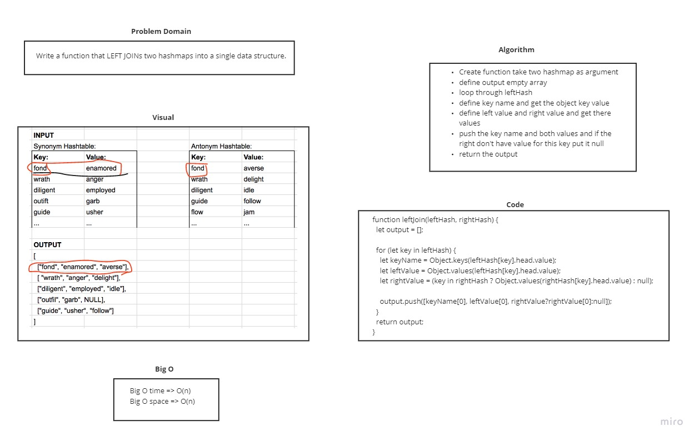

# Hashmap LEFT JOIN
The SQL LEFT JOIN returns all rows from the left table, even if there are no matches in the right table. This means that if the ON clause matches 0 (zero) records in the right table; the join will still return a row in the result, but with NULL in each column from the right table.

## Challenge
Write a function that LEFT JOINs two hashmaps into a single data structure.

## Approach & Efficiency
Big O time => O(n)
Big O space => O(n)

## Solution
