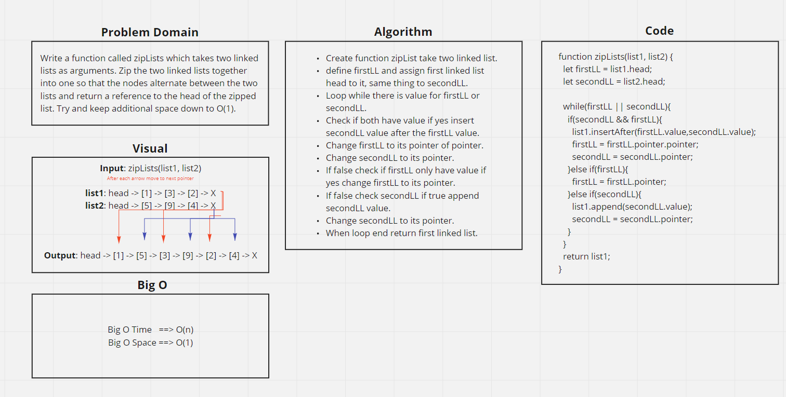

# zip Lists
Zip the two linked lists together into one

## Challenge
Write a function called zipLists which takes two linked lists as arguments. Zip the two linked lists together into one so that the nodes alternate between the two lists and return a reference to the head of the zipped list. Try and keep additional space down to O(1). You have access to the Node class and all the properties on the Linked List class as well as the methods created in previous challenges.

## Approach & Efficiency
Loop through all the nodes, assign second linked list to first linked list pointer then change first linked list to its pointer and assign it to second linked list pointer...

## Solution

