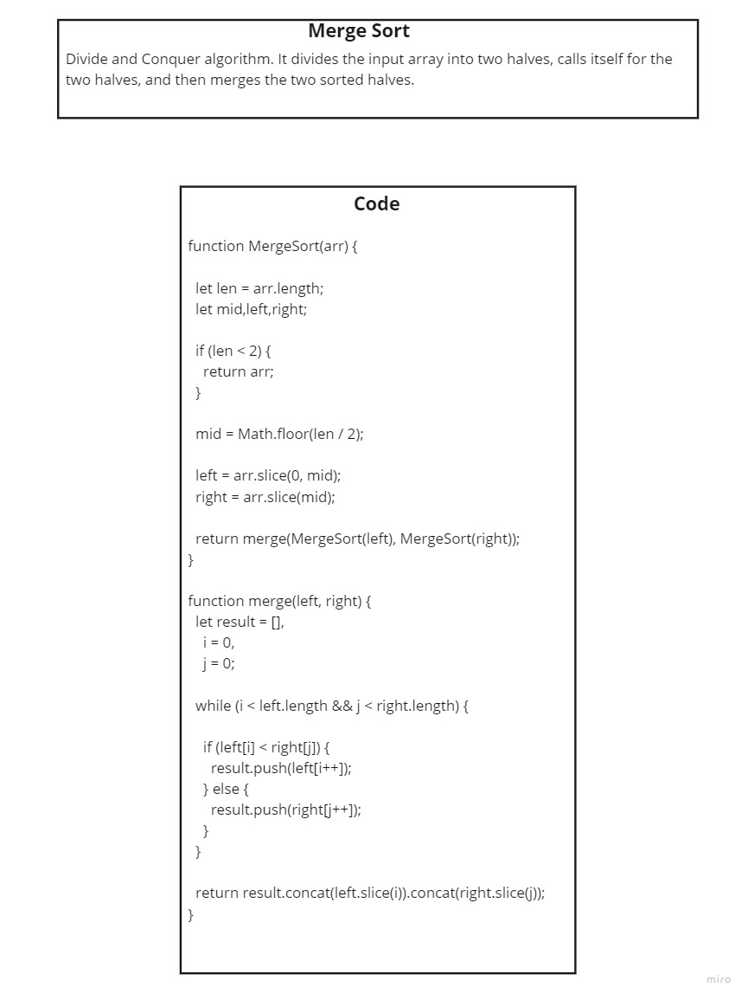

# Merge Sort

Divide and Conquer algorithm. It divides the input array into two halves, calls itself for the two halves, and then merges the two sorted halves.

## Challenge

* Provide a visual step through for each of the sample arrays based on the provided pseudo code
* Convert the pseudo-code into working code in your language
* Present a complete set of working tests

## Solution
