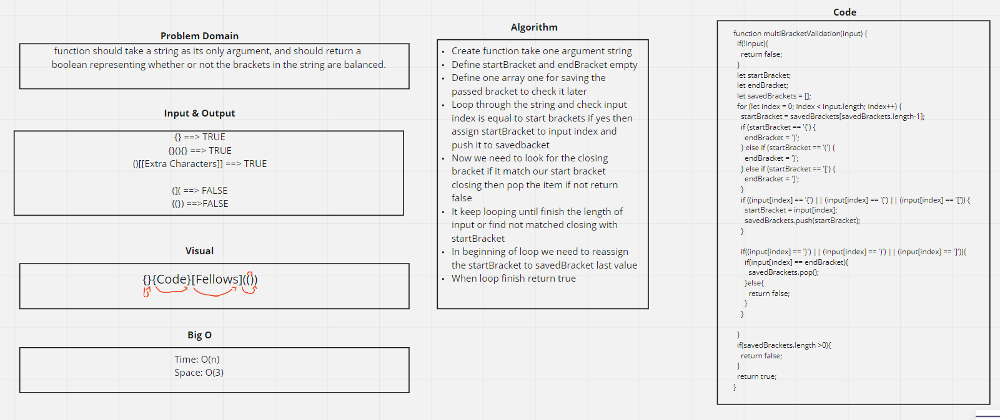

# Multi Bracket Validation
function should take a string as its only argument, and should return a boolean representing whether or not the brackets in the string are balanced.

## Challenge
Your function should take a string as its only argument, and should return a boolean representing whether or not the brackets in the string are balanced. There are 3 types of brackets:

* Round Brackets : ()
* Square Brackets : []
* Curly Brackets : {}

## Approach & Efficiency
Loop through the string and check for bracket if we find it we need to check the close bracket if it find another start bracket save the old bracket in array and find the new close bracket until it finish all the string.

## Solution

