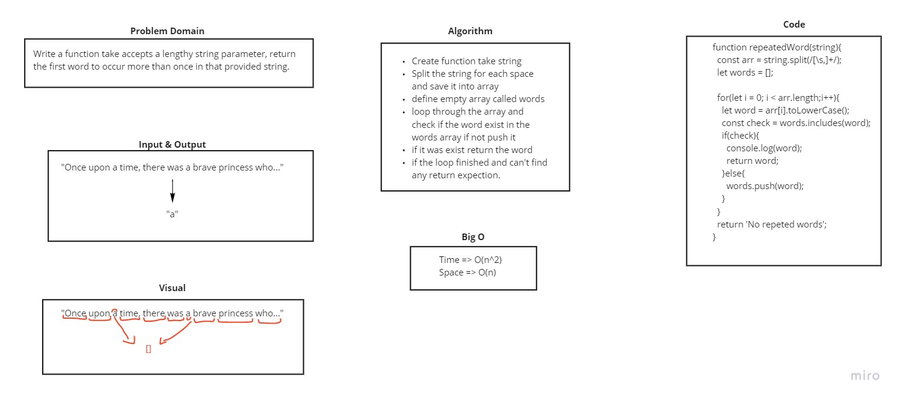

# Repeated word
Find the first repeated word in a book.

## Challenge
* Write a function that accepts a lengthy string parameter.
* Without utilizing any of the built-in library methods available to your language, return the first word to occur more than once in that provided string.

## Approach & Efficiency
Big O time => O(n^2)
Big O space => O(n)

## Solution
