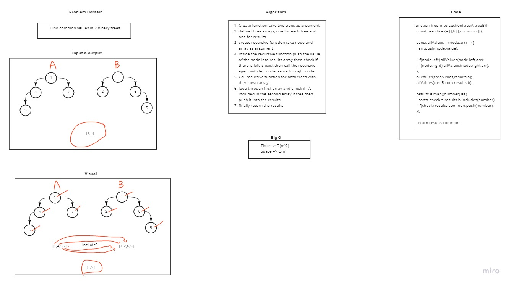

# Common values for trees
Find common values in 2 binary trees.

## Challenge
* Write a function called tree_intersection that takes two binary tree parameters.
* Without utilizing any of the built-in library methods available to your language, return a set of values found in both trees.

## Approach & Efficiency
Big O time => O(n^2)
Big O space => O(n)

## Solution
